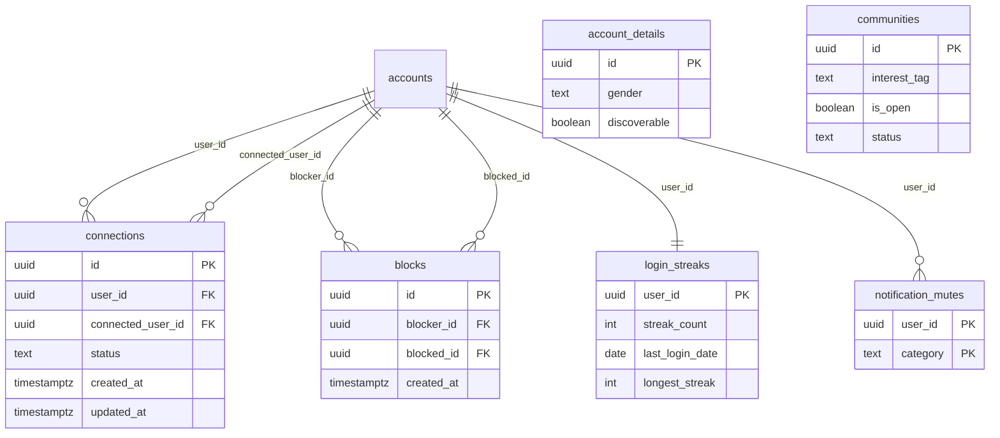

# Design Document: NEXO Connect Features

## Overview

This document describes the technical design for ten new features on the NEXO Connect platform at Cebu Technological University - Danao-Barangan Campus. The platform uses React/Vite on the frontend, Node.js/Express serverless functions in `/api`, Supabase PostgreSQL with Row Level Security, and Supabase Auth with JWT tokens.

The features address four capstone research questions:
- **RQ1.2** — Gender demographics (Requirement 1)
- **RQ2.2** — Peer connectivity (Requirements 3, 4)
- **RQ3.2** — Interest-based community management (Requirements 5, 6)
- **RQ5.3** — Engagement metrics (Requirement 8)

Additional improvements cover onboarding UX (Req 2), notification quality (Req 7), tutorial discoverability (Req 9), and the underlying database changes (Req 10).

---

## Architecture

The platform follows a layered architecture:

```
Browser (React/Vite)
  └─ Components (UserPortal, Onboarding, Auth, Landing, HelpModal)
       └─ src/lib/api.js  ──→  /api/* (Vercel Serverless Functions)
                                    └─ supabaseAdmin (service role)
                                    └─ supabase (anon/user JWT)
  └─ src/lib/supabase.js  ──→  Supabase (direct PostgREST + Realtime)
                                    └─ Tables with RLS
```

New features follow the same pattern:
- **Frontend-only changes** (Requirements 2, 9): Modify existing components with no new API routes.
- **Frontend + API changes** (Requirements 1, 8): Add fields to existing forms and extend existing API handlers.
- **New components + new API routes** (Requirements 3, 4, 5, 6, 7): New React components, new `/api` files, new Supabase tables.

```mermaid
flowchart TD
    A[Auth.jsx - Signup] -- gender field --> B[/api/signup.js]
    B --> C[(account_details)]
    D[Onboarding.jsx Step 3] -- interest gate --> E[ENTER NEXO btn]
    F[UserPortal.jsx] -- new nav tab --> G[DiscoverPeople.jsx]
    G --> H[/api/connections.js]
    H --> I[(connections)]
    H --> J[(blocks)]
    G --> K[/api/discover.js]
    K --> C
    K --> I
    K --> J
    L[Circle Creation Form] -- connection gate --> M[/api/communities.js]
    M --> N[(communities)]
    M --> I
    O[Login.js] -- streak logic --> P[/api/login.js extended]
    P --> Q[(login_streaks)]
    P --> C
    R[Notification_Service] --> S[(notifications - with category + mute)]
    T[Landing + HelpModal + Onboarding] --> U[NEXO_YOUTUBE_URL constant]
```

---

## Components and Interfaces

### 1. Gender Field — Auth.jsx + /api/signup.js

**Auth.jsx changes:**
- Add a `gender` field to the signup form's two-column grid, between USER_TYPE and PASSWORD.
- Use a `<select>` with options: `Male`, `Female`, `Prefer not to say`.
- Include client-side required validation (HTML5 `required` attribute).
- Pass `gender` in the POST body to `/api/signup`.

**`/api/signup.js` changes:**
- Accept `gender` from `req.body`.
- Validate that `gender` is one of the three allowed values before any DB write; return HTTP 400 with message `"Invalid gender value."` if not.
- Include `gender` in the `account_details` insert.

### 2. Onboarding Interest Gate — Onboarding.jsx

**Change**: Add `disabled={selectedInterests.length === 0}` to the "ENTER NEXO" button in Step 3. No backend changes needed.

### 3. Discover People Page — DiscoverPeople.jsx

New standalone component rendered inside `UserPortal.jsx` when the user navigates to the new `discover` section.

**Navigation**: Add a new entry to the sidebar navigation array in `UserPortal.jsx`:
```js
{ key: 'discover', label: 'Discover', icon: 'fa-solid fa-user-magnifying-glass' }
```
Place it adjacent to the Campus Events tab.

**DiscoverPeople component responsibilities:**
- Fetch users from a new `/api/discover` endpoint.
- Render two views: "All" (grouped by interest) and "Suggested" (overlap-first ordering).
- Render filter chips for each interest category.
- Render user cards with name, interests, course, connection status, and Connect button.
- Render Open Circle cards alongside user cards.
- Highlight circles where the viewer has a connection who is a member.

**`/api/discover.js` (new file):**
```
GET /api/discover?viewer_id=<uuid>
Response: {
  users: UserCard[],
  circles: CircleCard[],
}
```
Queries:
1. `account_details` joined with `account_status` — filter `is_verified=true`, `discoverable=true`, `interests IS NOT NULL AND array_length(interests,1) > 0`.
2. Exclude viewer's own account and users the viewer has blocked (check `blocks` table both directions).
3. `communities` — filter `is_open=true`.
4. `connections` — get the viewer's accepted connections to compute connection status per user and highlight circles.

### 4. Connection System — /api/connections.js

New serverless API file handling all connection and block operations.

**Endpoints:**

| Method | Action body / path | Description |
|--------|-------------------|-------------|
| POST | `{ action: 'request', to: uuid }` | Send connection request |
| POST | `{ action: 'accept', connection_id: uuid }` | Accept request |
| POST | `{ action: 'decline', connection_id: uuid }` | Decline request |
| POST | `{ action: 'remove', connection_id: uuid }` | Remove accepted connection |
| POST | `{ action: 'block', target_id: uuid }` | Block a user |
| POST | `{ action: 'unblock', target_id: uuid }` | Unblock a user |
| GET | `?viewer_id=uuid` | List viewer's connections + pending requests |

**Connection request logic:**
1. Check no existing `pending` record between the same pair (order-independent check: `(user_id=A AND connected_user_id=B) OR (user_id=B AND connected_user_id=A)`).
2. Check no `declined` record where `updated_at > now() - INTERVAL '7 days'`.
3. Insert record with `status='pending'`.
4. Insert notification for recipient: `type='connection_request'`, category=`Connections`.

**Accept logic:**
1. Update `status='accepted'`, `updated_at=now()`.
2. Insert notification for requester: `type='connection_accepted'`, category=`Connections`.

**Block logic:**
1. Insert into `blocks`.
2. Delete any `connections` record between the pair.
3. Insert notification suppression (no notification sent to blocked user).

**Stale request cleanup:** The 30-day auto-removal is handled by a Supabase scheduled function (pg_cron) or a cron job that runs `DELETE FROM connections WHERE status='pending' AND created_at < now() - INTERVAL '30 days'`.

### 5 & 6. Updated Circle Creation — /api/communities.js + Circle Form

**Connection gate (Req 5.1):** Before opening the circle creation form in `UserPortal.jsx`, count the viewer's `accepted` connections. If `< 2`, show a modal with the message "You need 2 connections to create a circle" and do not render the form.

**Circle creation form additions:**
- `Interest_Tag` dropdown: options are filtered client-side based on the selected Category using the `CATEGORY_INTEREST_MAP` constant (defined once, imported by both form and tests).
- "Open for Applications" toggle → sets `is_open`.
- Invite list restricted to connections array (populated from `/api/connections`).

**`/api/communities.js` changes:**
- On circle creation POST, insert into `communities` with `status='pending'`, `is_open`, `interest_tag`.
- Insert `memberships` row for creator with `status='pending'`.
- Insert `memberships` rows for each invited connection with `status='pending'`.
- Insert `notifications` for each invitee: `type='circle_invite'`, `category='Circles'`.

**Membership acceptance (existing circle-requests flow extended):**
- When a 3rd member accepts → update `communities.status='active'`, set creator `memberships.rank_level=3`.
- When leader leaves/is banned (pending circle) → delete circle, cancel invites, notify invitees.
- When leader leaves/is banned (active circle) → promote oldest co-leader (rank_level=2) or longest-standing member.

### 7. Notification Improvements — notifications table + Notification_Service

**Schema additions to `notifications`:**
- New column: `category` text — values `Connections`, `Circles`, `Campus`.
- New column: `group_key` text — used to identify groupable notifications (e.g. `connection_accepted_<user_id>`).
- New column: `group_count` int default 1 — summary count for grouped notifications.

**New table: `notification_mutes`**
```sql
CREATE TABLE notification_mutes (
  user_id uuid REFERENCES accounts(id) ON DELETE CASCADE,
  category text NOT NULL,
  PRIMARY KEY (user_id, category)
);
```

**Grouping logic:** When inserting a new notification, check if a notification with the same `group_key` exists for that user created within the last 10 minutes and is unread. If yes, increment `group_count` and update the message summary (e.g. "3 people accepted your connection request") instead of inserting a new row.

**Muting logic:** Before inserting a notification, check `notification_mutes` for the target user and category. If muted, skip the insert.

**Category mapping:**

| Notification type | Category |
|-------------------|----------|
| `connection_request`, `connection_accepted`, `connection_declined` | Connections |
| `circle_invite`, `join_approved`, `join_denied`, `kicked`, `promoted`, `circle_dissolved` | Circles |
| `new_announcement`, `campus_event`, `solution_marked` | Campus |

### 8. Daily Login Streak — /api/login.js + LoginStreakService

**`/api/login.js` extension** — after successful authentication, call `processLoginStreak(userId)`.

**`processLoginStreak(userId)` logic (inline in login.js or extracted to a helper):**

```
today = current UTC date (date only, no time)
record = SELECT FROM login_streaks WHERE user_id = userId

IF record IS NULL:
  INSERT (user_id, streak_count=1, last_login_date=today, longest_streak=1)
  points = 1
ELSE IF record.last_login_date == today:
  → already logged in today, skip (no double award)
  points = 0
ELSE:
  days_missed = today - record.last_login_date - 1
  IF days_missed == 0:
    new_streak = record.streak_count + 1     // consecutive day
  ELSE IF days_missed <= 2:
    new_streak = record.streak_count         // grace period: preserve streak
  ELSE:
    new_streak = 1                           // reset
  points = min(new_streak, 5) for day>=5 → 5, day4→4, day3→3, day2→2, day1→1
  longest = max(new_streak, record.longest_streak)
  UPDATE login_streaks SET streak_count=new_streak, last_login_date=today, longest_streak=longest

IF points > 0:
  new_tp = min(current_trust_points + points, 10)
  UPDATE account_status SET trust_points = new_tp
  return { streak: new_streak, points_awarded: points }
```

**Frontend: streak toast** — in `App.jsx` or `UserPortal.jsx`, after login the session response includes `{ streak, points_awarded }`. Show a toast: `"🔥 Day {streak} Streak! +{points} Trust Points"` for 4 seconds.

**Portal header flame icon** — stored in user state (loaded from `login_streaks` on mount), shown in the top-right header area: `🔥 {streak_count}`.

### 9. YouTube Tutorial Embed

**Single source of truth constant** — add to `src/lib/api.js` (or a new `src/lib/constants.js`):
```js
export const NEXO_YOUTUBE_EMBED_URL = 'https://www.youtube.com/embed/VIDEO_ID';
```

**Three embed locations** (all use the same import):
- `Landing.jsx` — add a `<section>` between "How it works" and "About", containing an `<iframe>` with `src={NEXO_YOUTUBE_EMBED_URL}`.
- `HelpModal.jsx` — add a video tab (or embed at top of Guide tab) with the `<iframe>`.
- `Onboarding.jsx` Step 1 — add the `<iframe>` below the avatar upload section.

**iframe template:**
```jsx
<iframe
  src={NEXO_YOUTUBE_EMBED_URL}
  title="NEXO Connect Tutorial"
  allow="accelerometer; autoplay; clipboard-write; encrypted-media; gyroscope; picture-in-picture"
  allowFullScreen
  style={{ width: '100%', aspectRatio: '16/9', border: 'none', borderRadius: 8 }}
/>
```

### 10. Database Schema Changes

New tables and columns are covered in the Data Models section. RLS policies are defined in the Error Handling and Security section.

---

## Data Models

### New Columns on Existing Tables

**`account_details` additions:**
```sql
ALTER TABLE account_details
  ADD COLUMN IF NOT EXISTS gender text CHECK (gender IN ('Male', 'Female', 'Prefer not to say')),
  ADD COLUMN IF NOT EXISTS discoverable boolean NOT NULL DEFAULT true;
```

**`communities` additions:**
```sql
ALTER TABLE communities
  ADD COLUMN IF NOT EXISTS interest_tag text,
  ADD COLUMN IF NOT EXISTS is_open boolean NOT NULL DEFAULT false,
  ADD COLUMN IF NOT EXISTS status text NOT NULL DEFAULT 'active'
    CHECK (status IN ('pending', 'active'));
```

Note: `DEFAULT 'active'` ensures all existing circles are grandfathered as active (Req 6.2).

**`notifications` additions:**
```sql
ALTER TABLE notifications
  ADD COLUMN IF NOT EXISTS category text CHECK (category IN ('Connections', 'Circles', 'Campus')),
  ADD COLUMN IF NOT EXISTS group_key text,
  ADD COLUMN IF NOT EXISTS group_count int NOT NULL DEFAULT 1;
```

### New Tables

**`connections`:**
```sql
CREATE TABLE IF NOT EXISTS connections (
  id uuid PRIMARY KEY DEFAULT gen_random_uuid(),
  user_id uuid NOT NULL REFERENCES accounts(id) ON DELETE CASCADE,
  connected_user_id uuid NOT NULL REFERENCES accounts(id) ON DELETE CASCADE,
  status text NOT NULL DEFAULT 'pending'
    CHECK (status IN ('pending', 'accepted', 'declined')),
  created_at timestamptz NOT NULL DEFAULT now(),
  updated_at timestamptz NOT NULL DEFAULT now(),
  CONSTRAINT connections_no_self CHECK (user_id <> connected_user_id),
  CONSTRAINT connections_unique_pair UNIQUE (user_id, connected_user_id)
);
CREATE INDEX IF NOT EXISTS idx_connections_user_id ON connections(user_id);
CREATE INDEX IF NOT EXISTS idx_connections_connected_user_id ON connections(connected_user_id);
CREATE INDEX IF NOT EXISTS idx_connections_status ON connections(status);
```

**`blocks`:**
```sql
CREATE TABLE IF NOT EXISTS blocks (
  id uuid PRIMARY KEY DEFAULT gen_random_uuid(),
  blocker_id uuid NOT NULL REFERENCES accounts(id) ON DELETE CASCADE,
  blocked_id uuid NOT NULL REFERENCES accounts(id) ON DELETE CASCADE,
  created_at timestamptz NOT NULL DEFAULT now(),
  CONSTRAINT blocks_no_self CHECK (blocker_id <> blocked_id),
  CONSTRAINT blocks_unique_pair UNIQUE (blocker_id, blocked_id)
);
CREATE INDEX IF NOT EXISTS idx_blocks_blocker_id ON blocks(blocker_id);
CREATE INDEX IF NOT EXISTS idx_blocks_blocked_id ON blocks(blocked_id);
```

**`login_streaks`:**
```sql
CREATE TABLE IF NOT EXISTS login_streaks (
  user_id uuid PRIMARY KEY REFERENCES accounts(id) ON DELETE CASCADE,
  streak_count int NOT NULL DEFAULT 0,
  last_login_date date,
  longest_streak int NOT NULL DEFAULT 0
);
```

**`notification_mutes`:**
```sql
CREATE TABLE IF NOT EXISTS notification_mutes (
  user_id uuid NOT NULL REFERENCES accounts(id) ON DELETE CASCADE,
  category text NOT NULL CHECK (category IN ('Connections', 'Circles', 'Campus')),
  PRIMARY KEY (user_id, category)
);
```

### Category → Interest Mapping

```js
export const CATEGORY_INTEREST_MAP = {
  Academic:  ['research', 'debate', 'business', 'language_learning', 'robotics', 'reading'],
  Hobby:     ['coding', 'design', 'gaming', 'music', 'art', 'photography', 'writing',
              'cooking', 'anime', 'fitness', 'podcasting', 'esports', 'dancing', 'bl_gl'],
  Social:    ['sports', 'travel', 'fitness', 'dancing', 'esports'],
  Project:   ['coding', 'robotics', 'design', 'business', 'research'],
};
```

This constant is defined once in `src/lib/constants.js` and imported by both the Circle Creation form and the test suite.

### ER Diagram (new tables only)



---

## Correctness Properties

*A property is a characteristic or behavior that should hold true across all valid executions of a system — essentially, a formal statement about what the system should do. Properties serve as the bridge between human-readable specifications and machine-verifiable correctness guarantees.*

### Property 1: Gender column accepts only valid values

*For any* string that is not one of `['Male', 'Female', 'Prefer not to say']`, attempting to insert it as the `gender` value in `account_details` should fail with a constraint error; and for each of the three valid values, the insert should succeed and a subsequent read should return the same value.

**Validates: Requirements 1.1, 1.5**

---

### Property 2: Gender signup round-trip

*For any* valid gender value, submitting a signup request with that gender value should result in the `account_details` row for that user containing the exact same gender value.

**Validates: Requirements 1.2**

---

### Property 3: Interest gate invariant

*For any* state of the interest selection on Onboarding Step 3, the "ENTER NEXO" button is enabled if and only if at least one interest is selected (`selectedInterests.length > 0`).

**Validates: Requirements 2.1, 2.2, 2.3**

---

### Property 4: Interests update round-trip

*For any* non-empty array of interest strings, updating `account_details.interests` for a verified user and immediately reading it back should return an array containing all and only the submitted interests.

**Validates: Requirements 2.4**

---

### Property 5: Discover page shows only valid users

*For any* set of users in the database, the Discover page results should contain only users where `is_verified = true`, `discoverable = true`, and `array_length(interests, 1) >= 1`. No user failing any of these conditions should appear.

**Validates: Requirements 3.2, 3.3**

---

### Property 6: Discover suggested view ordering

*For any* viewer with a known interest set, in the Suggested view, every user who shares at least one interest with the viewer should rank before (or at the same position as) any user who shares no interests with the viewer.

**Validates: Requirements 3.4**

---

### Property 7: Discover interest filter correctness

*For any* interest filter value selected on the Discover page, every user card displayed should have that interest present in their `interests` array, and no user card without that interest should be shown.

**Validates: Requirements 3.5**

---

### Property 8: Discover user card completeness

*For any* user returned by the discover endpoint, the rendered user card should include all four fields: full name, interests (at least one), course, and connection status relative to the viewer.

**Validates: Requirements 3.6**

---

### Property 9: Discover Open Circle visibility

*For any* set of circles, every circle with `is_open = true` should appear in the Discover page results, and no circle with `is_open = false` should appear in the Discover page results.

**Validates: Requirements 3.8, 6.6**

---

### Property 10: Discover connection network prioritization

*For any* viewer who has at least one accepted connection who is a member of an open circle, that circle's card should appear with a visual highlight/priority indicator in the Discover page render.

**Validates: Requirements 3.9**

---

### Property 11: Connect button visibility rule

*For any* user card on the Discover page, the Connect button should be visible if and only if the viewer has no accepted or pending connection with that user AND has not blocked that user.

**Validates: Requirements 3.10**

---

### Property 12: Connection creation and notification

*For any* two verified users A and B with no existing connection, when A sends a connection request to B, the `connections` table should contain a record with `user_id=A`, `connected_user_id=B`, `status='pending'`, and the `notifications` table should contain a record with `user_id=B` of type `connection_request`.

**Validates: Requirements 4.1, 4.2**

---

### Property 13: Connection acceptance round-trip

*For any* pending connection request, when the recipient accepts it, the record's status should become `'accepted'` and a notification of type `connection_accepted` should exist for the original requester.

**Validates: Requirements 4.3**

---

### Property 14: Connection decline state transition

*For any* pending connection request, when the recipient declines it, the record's status should become `'declined'` and no notification should be sent to the requester.

**Validates: Requirements 4.4**

---

### Property 15: No duplicate pending connections

*For any* two users A and B, at any point in time there should be at most one connection record with `status='pending'` between them (in either direction).

**Validates: Requirements 4.5**

---

### Property 16: Connection count reflects accepted connections

*For any* user, their displayed connection count should equal the number of records in the `connections` table where `(user_id = userId OR connected_user_id = userId) AND status = 'accepted'`.

**Validates: Requirements 4.7**

---

### Property 17: Connection removal preserves memberships

*For any* two users A and B who are connected and share circle memberships, removing the connection between them should result in no connection record existing between them, while all `memberships` rows for both users in shared circles remain unchanged.

**Validates: Requirements 4.9**

---

### Property 18: Block creates record and removes connection

*For any* user A blocking user B, after the block action: a record should exist in `blocks` with `blocker_id=A, blocked_id=B`; any connection record between A and B should not exist; user B should not appear in A's Discover page results.

**Validates: Requirements 4.10**

---

### Property 19: Discoverable toggle round-trip

*For any* user, toggling `account_details.discoverable` to `false` and reading it back should return `false`; toggling it back to `true` should return `true`.

**Validates: Requirements 4.12**

---

### Property 20: Connection gate for circle creation

*For any* verified user with fewer than 2 accepted connections, attempting to open the Circle Creation form should result in the form not being shown and the message "You need 2 connections to create a circle" being displayed.

**Validates: Requirements 5.1**

---

### Property 21: Interest tag filtered by category

*For any* category selection in the Circle Creation form, every interest tag option displayed should be a member of `CATEGORY_INTEREST_MAP[category]`, and no interest tag outside that mapping should appear.

**Validates: Requirements 5.2**

---

### Property 22: is_open round-trip

*For any* circle created with `is_open = true`, reading `communities.is_open` for that circle should return `true`. For any circle created with `is_open = false`, reading it should return `false`.

**Validates: Requirements 5.3**

---

### Property 23: Invite list restricted to connections

*For any* circle creation request, every `user_id` in the invite list should have an accepted connection record with the creator. Any invitee not in the creator's connections list should be rejected.

**Validates: Requirements 5.4**

---

### Property 24: Invite notifications sent to all invitees

*For any* circle created with N invited connections, exactly N notifications of type `circle_invite` should be inserted into the `notifications` table, one per invitee.

**Validates: Requirements 5.5**

---

### Property 25: Circle pending-to-active state machine

*For any* newly created circle, `communities.status` should be `'pending'`; after the 2nd invitee (3rd member total) accepts, `communities.status` should be `'active'`.

**Validates: Requirements 5.6**

---

### Property 26: Circle cancellation cleans up all records

*For any* pending circle that the creator cancels, the circle record should not exist in `communities`, all associated `memberships` rows should be deleted, and one `circle_dissolved` notification should exist for each originally invited user.

**Validates: Requirements 5.8**

---

### Property 27: Active circle status is permanent

*For any* active circle, no change in member count (additions or removals of members) should cause `communities.status` to change from `'active'`.

**Validates: Requirements 6.1**

---

### Property 28: Creator rank promotion on activation

*For any* circle that transitions from `'pending'` to `'active'`, the creator's `memberships.rank_level` for that circle should be `3`.

**Validates: Requirements 6.3**

---

### Property 29: Leader succession on departure

*For any* active circle where the leader (rank_level=3) leaves or is banned: if a co-leader (rank_level=2) exists, the oldest co-leader should become the new leader (rank_level=3); if no co-leader exists, the longest-standing active member should be promoted to rank_level=3.

**Validates: Requirements 6.4**

---

### Property 30: Pending circle auto-dissolves on leader departure

*For any* pending circle where the leader leaves or is banned before activation, the circle should not exist in `communities` and all invitees should receive a `circle_dissolved` notification.

**Validates: Requirements 6.5**

---

### Property 31: Closed circle rejects non-invited members

*For any* circle where `is_open = false`, a join attempt from a user who has not received a `circle_invite` should be rejected.

**Validates: Requirements 6.7**

---

### Property 32: Admin badge shows for pending circles

*For any* admin dashboard render, the Circles navigation badge should be visible with a count > 0 if and only if at least one circle has `status = 'pending'`, and hidden when no pending circles exist.

**Validates: Requirements 6.8**

---

### Property 33: Notification grouping reduces count

*For any* N notifications of the same `group_key` for the same user created within the grouping window, the `notifications` table should contain exactly 1 row for that group_key with `group_count = N`, not N separate rows.

**Validates: Requirements 7.1**

---

### Property 34: Notification category mapping is total

*For any* notification `type` string used by the system, the category mapping function should return exactly one of `'Connections'`, `'Circles'`, or `'Campus'` — never null or undefined.

**Validates: Requirements 7.2**

---

### Property 35: Muted category suppresses notifications

*For any* user with a muted category C, no notification with `category = C` should be inserted into `notifications` for that user after the mute is set.

**Validates: Requirements 7.3**

---

### Property 36: Login streak state machine

*For any* initial streak state (streak_count, last_login_date) and a current login date:
- If `days_since_last = 1`: new streak = old streak + 1
- If `days_since_last IN (2, 3)` (grace period, 1–2 missed days): new streak = old streak (preserved)
- If `days_since_last >= 4` (3+ missed days): new streak = 1
- If `days_since_last = 0` (same day): no change

**Validates: Requirements 8.1, 8.2, 8.5, 8.6**

---

### Property 37: Trust points award schedule

*For any* streak_count value after a login, the trust points awarded should follow: `min(streak_count, 5)` — i.e., 1 for day 1, 2 for day 2, 3 for day 3, 4 for day 4, 5 for day 5 and beyond.

**Validates: Requirements 8.3**

---

### Property 38: Trust points cap at 10

*For any* current trust_points value and any streak_count, applying the login streak trust point award should result in `trust_points <= 10`. No login should cause trust_points to exceed 10.

**Validates: Requirements 8.4**

---

### Property 39: Streak toast contains required information

*For any* login response with `streak >= 1` and `points_awarded >= 1`, the rendered toast message string should contain both the streak count value and the points_awarded value.

**Validates: Requirements 8.7, 8.8**

---

### Property 40: Login streaks round-trip

*For any* user, after their first login, a `login_streaks` row should exist with all four fields (`user_id`, `streak_count`, `last_login_date`, `longest_streak`) populated with non-null values.

**Validates: Requirements 8.10, 10.3**

---

### Property 41: RLS users can only access own connection/block records

*For any* two distinct users A and B with separate JWT tokens, user A's token should not be able to read connection or block records where neither `user_id`, `connected_user_id`, `blocker_id`, nor `blocked_id` equals A's `user_id`.

**Validates: Requirements 10.6**

---

## Error Handling

### Validation Errors (HTTP 400)
- Invalid gender value on signup → `{ message: "Invalid gender value. Must be Male, Female, or Prefer not to say." }`
- Missing required signup fields → existing pattern with descriptive messages
- Circle creation with < 2 connections → blocked client-side; `/api/communities` also validates server-side
- Duplicate connection request → `{ message: "A pending request already exists." }`
- Connection request to recently declined target → `{ message: "You cannot send another request for 7 days after a decline." }`
- Invalid invite list (non-connection) → `{ message: "You can only invite your connections." }`

### Authorization Errors (HTTP 401/403)
- Unauthenticated requests to `/api/connections`, `/api/discover` → HTTP 401
- Non-admin attempting to read all blocks → HTTP 403 (RLS handles this at DB level)

### RLS Policies for New Tables

**`connections` RLS:**
```sql
ALTER TABLE connections ENABLE ROW LEVEL SECURITY;

-- Users can read their own connections (either side)
CREATE POLICY "Users read own connections"
  ON connections FOR SELECT TO authenticated
  USING (auth.uid() = user_id OR auth.uid() = connected_user_id);

-- Users can insert requests where they are the requester
CREATE POLICY "Users insert own requests"
  ON connections FOR INSERT TO authenticated
  WITH CHECK (auth.uid() = user_id);

-- Users can update requests where they are the recipient
CREATE POLICY "Users update own received requests"
  ON connections FOR UPDATE TO authenticated
  USING (auth.uid() = connected_user_id OR auth.uid() = user_id);

-- Users can delete their own connections
CREATE POLICY "Users delete own connections"
  ON connections FOR DELETE TO authenticated
  USING (auth.uid() = user_id OR auth.uid() = connected_user_id);

-- Service role full access
CREATE POLICY "Service role full access"
  ON connections TO service_role USING (true) WITH CHECK (true);
```

**`blocks` RLS:**
```sql
ALTER TABLE blocks ENABLE ROW LEVEL SECURITY;

-- Users can read their own block relationships
CREATE POLICY "Users read own blocks"
  ON blocks FOR SELECT TO authenticated
  USING (auth.uid() = blocker_id OR auth.uid() = blocked_id);

-- Users can insert blocks where they are the blocker
CREATE POLICY "Users insert own blocks"
  ON blocks FOR INSERT TO authenticated
  WITH CHECK (auth.uid() = blocker_id);

-- Users can delete their own blocks
CREATE POLICY "Users delete own blocks"
  ON blocks FOR DELETE TO authenticated
  USING (auth.uid() = blocker_id);

-- Service role full access
CREATE POLICY "Service role full access"
  ON blocks TO service_role USING (true) WITH CHECK (true);
```

**`login_streaks` RLS:**
```sql
ALTER TABLE login_streaks ENABLE ROW LEVEL SECURITY;

CREATE POLICY "Users read own streak"
  ON login_streaks FOR SELECT TO authenticated
  USING (auth.uid() = user_id);

CREATE POLICY "Service role full access"
  ON login_streaks TO service_role USING (true) WITH CHECK (true);
```

**`notification_mutes` RLS:**
```sql
ALTER TABLE notification_mutes ENABLE ROW LEVEL SECURITY;

CREATE POLICY "Users manage own mutes"
  ON notification_mutes FOR ALL TO authenticated
  USING (auth.uid() = user_id) WITH CHECK (auth.uid() = user_id);

CREATE POLICY "Service role full access"
  ON notification_mutes TO service_role USING (true) WITH CHECK (true);
```

### Frontend Error Handling
- Connection API failures → toast notification: "Connection failed. Please try again."
- Discover page load failure → empty state with retry button
- Streak toast only shown when `points_awarded > 0` to avoid noise on same-day re-logins
- Circle creation gate failure → inline message below the create button

---

## Testing Strategy

### Dual Approach

Testing uses both unit/integration examples and property-based tests. Unit tests cover specific flows and edge cases; property-based tests verify universal correctness across all inputs.

### Property-Based Testing

**Library:** [fast-check](https://fast-check.dev/) for JavaScript/TypeScript property-based testing.

**Configuration:** Each property test runs a minimum of **100 iterations**.

**Tag format:** Each test is tagged in a comment:
```
// Feature: nexo-connect-features, Property N: <property text>
```

**Properties to implement as automated PBT tests:**

| Property | Test target | Arbitraries needed |
|----------|-------------|-------------------|
| 1 — Gender column constraint | `account_details` insert | `fc.string()` filtered to invalid values; valid enum |
| 2 — Gender signup round-trip | `/api/signup` handler | `fc.constantFrom('Male','Female','Prefer not to say')` |
| 3 — Interest gate invariant | `Onboarding.jsx` render | `fc.array(fc.constantFrom(...INTERESTS))` |
| 4 — Interests update round-trip | Supabase update + select | `fc.array(fc.constantFrom(...INTERESTS), {minLength:1})` |
| 5 — Discover filters | `discoverUsers()` function | `fc.record({ is_verified, discoverable, interests })` |
| 6 — Suggested view ordering | sort function | `fc.array(UserRecord)` with viewer interests |
| 7 — Interest filter correctness | filter function | `fc.constantFrom(...INTERESTS)` + user array |
| 8 — User card completeness | render function | `fc.record(UserCard)` |
| 9 — Open circle visibility | `discoverCircles()` | `fc.record({ is_open: fc.boolean() })` |
| 12 — Connection creation | `Connection_Service.request()` | two user IDs |
| 15 — No duplicate pending | `Connection_Service.request()` called N times | `fc.integer({min:2, max:10})` |
| 16 — Connection count | profile render | `fc.array(ConnectionRecord)` |
| 21 — Interest tag by category | `getInterestTagsForCategory()` | `fc.constantFrom(...CATEGORIES)` |
| 25 — Circle state machine | `Membership_Service.acceptInvite()` | accept sequence scenarios |
| 33 — Notification grouping | `Notification_Service.insert()` | `fc.integer({min:1, max:20})` notifications |
| 34 — Category mapping is total | `notificationCategory(type)` | `fc.constantFrom(...ALL_NOTIFICATION_TYPES)` |
| 35 — Muted category suppresses | `Notification_Service.insert()` | category + muted set |
| 36 — Streak state machine | `processLoginStreak()` | `fc.record({ streak_count, last_login_date, today })` |
| 37 — Trust points schedule | `computeStreakPoints()` | `fc.integer({min:1, max:20})` |
| 38 — Trust points cap | `applyStreakPoints()` | `fc.integer({min:0, max:10})` + `fc.integer({min:1,max:5})` |
| 41 — RLS own records only | Supabase RLS integration | two distinct user sessions |

### Unit Tests (Examples and Edge Cases)

- **Signup without gender**: verify form submit is blocked client-side.
- **Discover page navigation**: verify new tab is adjacent to Campus Events tab.
- **User profile click**: verify click on user card navigates to profile view.
- **YouTube iframes**: verify each of the 3 embed locations renders an `<iframe>` with `src` matching `NEXO_YOUTUBE_EMBED_URL`.
- **Connection cooldown edge case**: request immediately after decline within 7 days → rejected.
- **Grace period edge case**: streak preserved after exactly 1 and 2 days missed.
- **Streak reset**: streak resets to 1 after 3+ days missed.
- **Admin pending circles badge**: badge shown when count > 0, hidden when 0.
- **Circle creation with exactly 2 connections**: form opens; with 1 connection: gate message shown.

### Test File Locations

```
capstone-react/src/__tests__/
  gender.test.js
  onboarding-gate.test.js
  discover.test.js
  connections.test.js
  circle-creation.test.js
  notifications.test.js
  login-streak.test.js
  youtube-embed.test.js
```

### Test Framework

Use **Vitest** (already implied by Vite setup) with `@testing-library/react` for component tests and `fast-check` for property tests.

```json
// package.json dev dependencies to add:
"fast-check": "^3.22.0",
"@testing-library/react": "^16.3.0",
"@testing-library/jest-dom": "^6.6.3",
"vitest": "^3.2.4"
```
